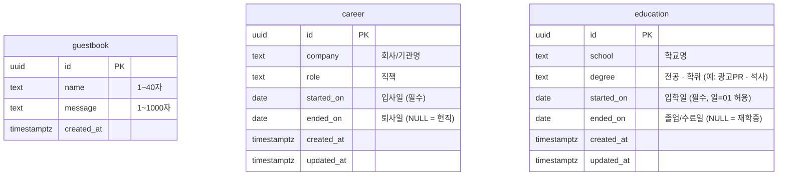

# Database ERD

Supabase (PostgreSQL) 에 정의된 모든 테이블의 스키마 다이어그램입니다. 마이그레이션 SQL 파일은 같은 디렉터리의 `0001_*.sql`, `0002_*.sql` … 순서대로 정리되어 있으며, **이 문서와 SQL 파일은 함께 갱신됩니다**.

## ERD

> 현재 도메인 상 테이블 간 직접 관계 (FK) 는 없습니다. 모두 독립적인 콘텐츠 테이블.

## 테이블별 설명

### `guestbook`
- 방문자가 사이트 푸터 부근의 폼에서 남기는 익명 메시지.
- RLS: 누구나 select / insert. update / delete 차단.
- 정렬: `created_at desc`, 최근 50건 표시.
- 마이그레이션: [0001_guestbook.sql](0001_guestbook.sql)

### `career`
- Hero 아래 **Career** 섹션에 노출.
- `started_on` / `ended_on` 으로 기간을 표현. `ended_on IS NULL` 이면 "현재".
- 정렬: `started_on desc` (최신 경력 위).
- RLS: 누구나 select. insert / update / delete 차단 (콘텐츠 편집은 service_role 또는 Supabase Studio 로만).
- 마이그레이션: [0002_career_education.sql](0002_career_education.sql)

### `education`
- **Education** 섹션에 노출.
- `started_on` / `ended_on` 둘 다 `date` 형. 학력은 일 단위가 의미가 없으므로 일=01 로 통일해서 저장.
- 정렬: `started_on desc`.
- RLS: career 와 동일.
- 마이그레이션: [0002_career_education.sql](0002_career_education.sql)

## 표시 형식 규칙

UI 에서 기간을 표시할 때는 다음 규칙을 따른다:

- 시작/종료가 모두 있는 경우: `YYYY.MM — YYYY.MM`
- 종료가 없는 경우 (`ended_on IS NULL`): `YYYY.MM — 현재`

formatter 는 [app/components/Career.tsx](../../app/components/Career.tsx) / [app/components/Education.tsx](../../app/components/Education.tsx) 에 위치.
